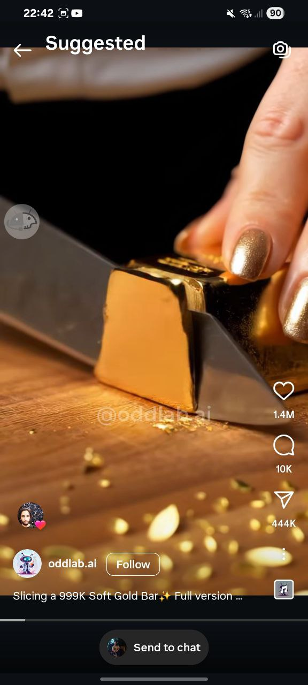
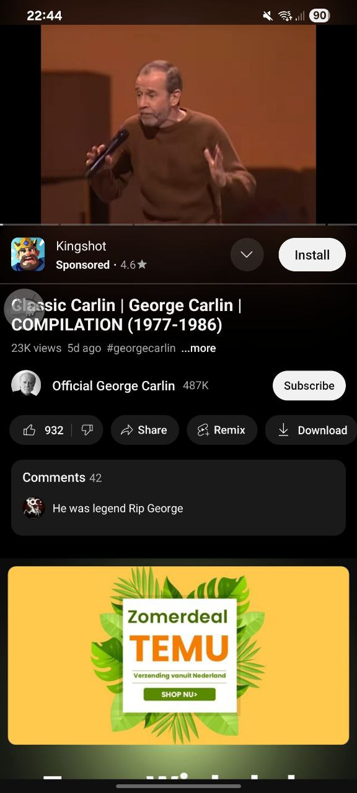

# Mitigating Engagement Risks in Instagram and YouTube Using GreaseMilkyway

This repository contains GreaseMilkyway rule sets designed to reduce engagement-driven distractions on **Instagram** and **YouTube**, in line with the systemic risk mitigation goals of the **Digital Services Act (DSA)**.

Our approach focuses on removing **like, comment, and share** buttons and counts — which are often sources of addictive feedback loops — in Instagram interfaces.

---

## Platforms Targeted

### Instagram
- **Reels Viewer:**
  - Buttons (like, comment, share) are hidden using a **transparent overlay** to preserve layout flow.
  - Counts (like, comment, share) are blocked with a **solid black overlay** to visually suppress engagement metrics.
- **Feed Posts:**
  - Same pattern used: transparent overlays for buttons, opaque overlays for counts.
  - All elements are blocked **with touch disabled**, regardless of transparency.

📸 **Before & After Examples:**

| Reels Before | Reels After |
|--------------|-------------|
|  |  |

| Feed Before | Feed After |
|-------------|------------|
|  |  |

---

###  YouTube
- Blocks the **install app banner** that appears under video content using a solid black overlay.
- All overlays also disable interaction with these elements.

📺 **Before & After:**

| YouTube Banner Before | YouTube Banner After |
|------------------------|-----------------------|
|  |  |

---

## How It Works

All rules use the GreaseMilkyway syntax:

- `viewId` targets specific UI components in each app.
- `blockTouches=true` ensures users cannot interact with hidden elements.
- `color=00000000` (transparent) used for buttons to maintain UI structure.
- `color=000000` (black) used for counts to visually suppress engagement signals.

---

